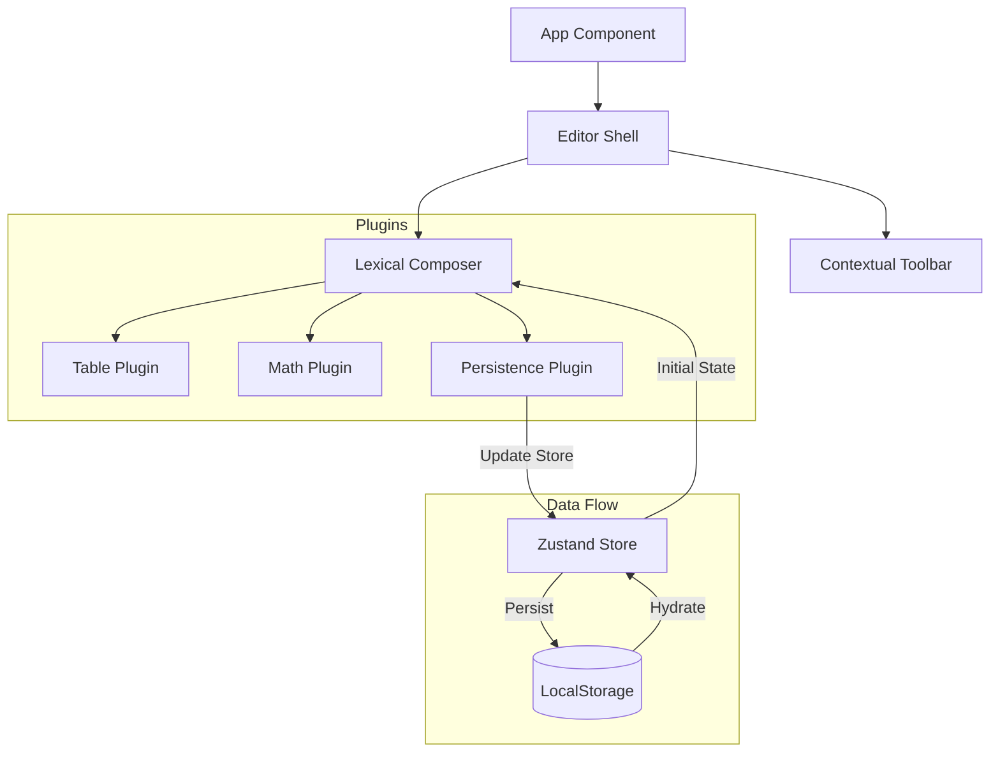

# Hiring Challenge Submission: Lexical Rich Text Editor

A premium, modern rich text editor built with Lexical, Zustand, and React.

*A professional, extensible rich text editor with Math and Table support.*

---

## 🚀 Requirement Mapping (Architecture & Design)

### 1. Lexical Editor Setup
- **Architecture**: Utilizes `LexicalComposer` for initialization and React bindings (`@lexical/react`). This is the heart of the setup, providing a single source of truth.
- **Conceptual Implementation**:
    - **Editor Instances**: Accessed via `useLexicalComposerContext()`. This allows plugins and the toolbar to interact with a shared, consistent editor engine.
    - **Editor State**: Treated as immutable. Serialized to JSON using `editor.getEditorState().toJSON()` for persistence and restored via `initialConfig`.
    - **Updates**: All modifications are wrapped in `editor.update(() => { ... })`, ensuring Lexical's reconciliation logic manages the DOM.
    - **Plugins**: Decoupled features (Math, Table, Persistence) as modular React components.
- **No DOM Hacks**: Strict adherence to Lexical's state-driven architecture; **zero** direct DOM manipulation.

### 2. Table Support
- **Modular Implementation**: Leverages `@lexical/table` utilities for a robust and scalable architecture. The logic is separated from UI controls, making it easy to extend.
- **Customizable Insertion**: Users can specify the exact number of **Rows and Columns** via a toolbar prompt, providing immediate flexibility.
-
- **Architecture**: All table manipulations (add/delete row/column) are handled via standard Lexical commands and selection-based functions, ensuring correctness and modularity.

### 3. Mathematical Expressions
- **Engine**: Integrated **KaTeX** for standard LaTeX-style syntax rendering.
- **Versatility**: Supports both **inline** and **block** expressions.
- **Interactive Editing**: 
    - Formulas are not static; clicking a rendered equation opens a real-time edit prompt.
    - Uses `editor.update` to modify the `MathNode` state, ensuring the UI re-renders immediately.
- **Auto-Conversion**: Implemented a "Smart Transform" that detects `$equation$` patterns in real-time as the user types, converting them into live Math nodes.
- **Integration**: Focused on a seamless user experience where math feels like a native part of the document, not an external iframe or static image.

### 4. State Management (Zustand)
- **State Modeling Decisions**:
    - **Editor Content**: Managed as a serialized JSON string (`editorStateJSON`). This keeps the store lightweight and serializable.
    - **UI State**: Separated from content. Includes `isSaving` (spinner status), `hydrated` (loading state), and `history` (versioning).
- **Performance & Re-render Optimization**:
    - **Atomic Selectors**: The app uses selective state extraction (e.g., `useEditorStore(state => state.isSaving)`) to ensure that components only re-render when the specific data they need changes.
    - **Middleware**: Used `persist` middleware to automatically handle the bridge between the in-memory store and `localStorage`.
- **Decoupling**: The UI components (like the Toolbar) don't even know where the data is being saved; they simply call actions like `setEditorStateJSON`, making the state modeling highly maintainable.

### 5. Persistence & Future-Proof API Structure
- **Auto-Save**: The `PersistencePlugin` serializes the state to JSON on every change.
- **Architectural Scalability**: 
    - No direct backend is used, but the code is structured as if APIs exist.
    - All storage logic is isolated in a modular **Zustand store** with `persist` middleware.
    - Switching from `localStorage` to a real REST/GraphQL API would only require a change in the store's configuration, keeping the Editor core untouched.
- **Mocking**: The Version History system acts as a mock for an activity log or document storage API.

---

## 🏗️ Technical Architecture

## 🛠️ Tech Stack
- **Framework**: React 19
- **Editor Engine**: Lexical
- **State**: Zustand
- **Icons**: Lucide React
- **Math**: KaTeX
- **Build Tool**: Vite

## 📦 Getting Started
1. `npm install`
2. `npm run dev`
3. Open `http://localhost:5173` and type `$\frac{a}{b}$` to test math auto-conversion!

---
## Developed by -Geetanshi jain - jaingeetanshi175@gmail.com 
